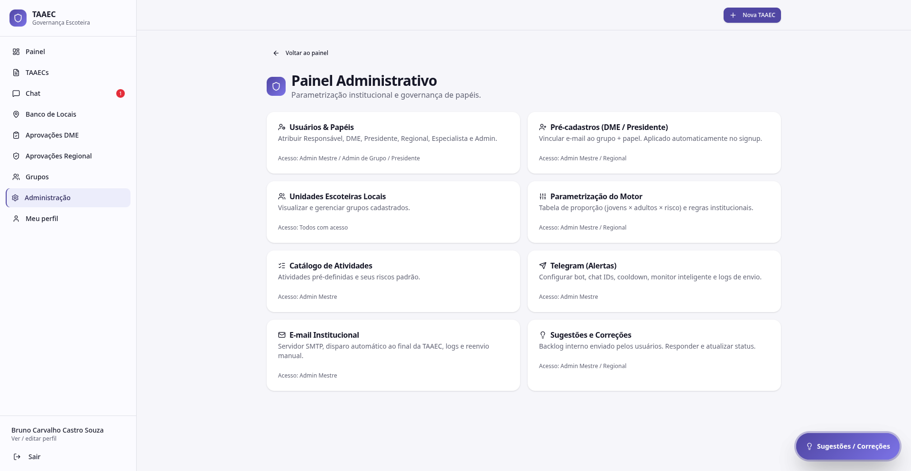

# Administração

A página **Administração** é o índice de todos os recursos administrativos do TAAEC: parametrização institucional, governança de papéis, catálogos e integrações.

---

## Quem acessa

Cada card declara explicitamente quem pode entrar. Os papéis típicos:

- **Admin Mestre** — acesso total
- **Regional** — acesso a parametrização, pré-cadastros e sugestões
- **Admin de Grupo / Presidente** — acesso a usuários do próprio grupo

Se você não tem o papel necessário, o card existe mas a página interna nega o acesso.

---

## Recursos disponíveis

### Usuários & Papéis

> Atribuir Responsável, DME, Presidente, Regional, Especialista e Admin.
>
> **Acesso:** Admin Mestre / Admin de Grupo / Presidente

Tela central de governança de quem-pode-o-quê. Detalhe em [Usuários & Papéis](usuarios-papeis.md).

### Pré-cadastros (DME / Presidente)

> Vincular e-mail ao grupo + papel. Aplicado automaticamente no signup.
>
> **Acesso:** Admin Mestre / Regional

Antecipa o vínculo de papel para que a pessoa já entre com permissão correta no primeiro login. Detalhe em [Pré-cadastros](pre-cadastros.md).

### Unidades Escoteiras Locais

> Visualizar e gerenciar grupos cadastrados.
>
> **Acesso:** Todos com acesso

Atalho para [Grupos](../modulos/grupos.md).

### Parametrização do Motor

> Tabela de proporção (jovens × adultos × risco) e regras institucionais.
>
> **Acesso:** Admin Mestre / Regional

Onde a Regional define as regras que o [motor de risco](../modulos/motor-de-risco.md) aplica. Detalhe em [Parametrização](parametros.md).

### Catálogo de Atividades

> Atividades pré-definidas e seus riscos padrão.
>
> **Acesso:** Admin Mestre

Lista de atividades (acampamento, fogueira, canoagem, arco e flecha, etc.) com classificação de risco padrão. Detalhe em [Catálogo](catalogo.md).

### Telegram (Alertas)

> Configurar bot, chat IDs, cooldown, monitor inteligente e logs de envio.
>
> **Acesso:** Admin Mestre

Configuração do canal de alertas críticos. Detalhe em [Notificações → Telegram](notificacoes.md#telegram).

### E-mail Institucional

> Servidor SMTP, disparo automático ao final da TAAEC, logs e reenvio manual.
>
> **Acesso:** Admin Mestre

Configuração SMTP e fila de envio. Detalhe em [Notificações → E-mail](notificacoes.md#e-mail-institucional).

### Sugestões e Correções

> Backlog interno enviado pelos usuários. Responder e atualizar status.
>
> **Acesso:** Admin Mestre / Regional

Caixa de entrada das sugestões enviadas via balão flutuante. Veja como funciona o canal em [Sugestões](../modulos/sugestoes.md).

---

## Princípio de segurança

A administração segue princípios:

1. **Tabela separada de papéis** — papéis não ficam na mesma tabela do usuário, impedindo escalação por edição direta
2. **Validação server-side** — toda mudança de papel passa por Edge Function autenticada, mesmo se a UI permitir
3. **Audit log automático** — toda atribuição, revogação e mudança de parametrização é registrada por trigger
4. **Princípio do menor privilégio** — cada card pede o papel mínimo necessário (Regional não consegue editar catálogo, por exemplo)
