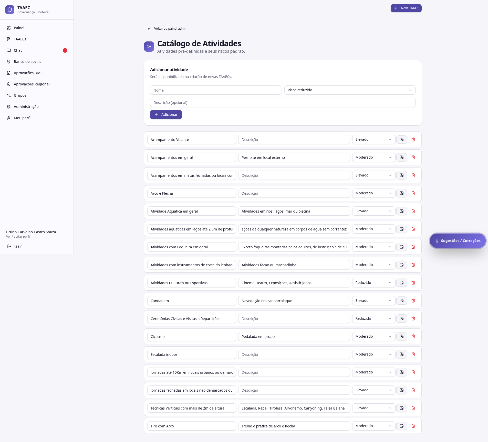

# Catálogo de Atividades

A tela **Catálogo de Atividades** mantém a lista de **atividades escoteiras pré-definidas** que aparecem no wizard de criação da TAAEC, com a classificação de risco padrão de cada uma.

---

## Quem acessa

- **Admin Mestre** (acesso exclusivo)

---

## O que está no catálogo

Uma lista institucional de atividades, cada uma com:

| Campo | Conteúdo |
|---|---|
| **Nome** | Descrição da atividade (ex: *Acampamentos em geral*) |
| **Risco padrão** | Reduzido / Moderado / Elevado |
| **Ramos aplicáveis** | Lobinho, Escoteiro, Sênior, Pioneiro (opcional) |
| **Observações** | Notas institucionais (ex: requisitos especiais) |
| **Status** | Ativa / Arquivada |

---

## Atividades comuns (padrão atual)

Lista usada no wizard, exemplificada:

| Atividade | Risco padrão |
|---|---|
| Acampamento Volante | elevado |
| Acampamentos em geral | moderado |
| Acampamentos em matas fechadas ou locais com acesso ao Público | elevado |
| Arco e Flecha / Tiro com Arco | moderado |
| Atividade Aquática em geral | elevado |
| Atividades aquáticas em lagos até 2,5m de profundidade | moderado |
| Atividades com Fogueira em geral | moderado |
| Atividades com instrumentos de corte do lenhador | moderado |
| Atividades Culturais ou Esportivas | reduzido |
| Canoagem | elevado |
| Cerimônias Cívicas e Visitas a Repartições | reduzido |
| Ciclismo | moderado |
| Escalada indoor | moderado |
| Jornadas até 10Km em locais urbanos ou demarcados | moderado |
| Jornadas fechadas em locais não demarcados ou superior a 10km | elevado |
| Técnicas Verticais com mais de 2m de altura | elevado |

---

## Como o catálogo aparece no wizard

No [wizard de criação da TAAEC](../modulos/taaecs.md#criar-uma-nova-taaec), na seção **1. Identificação da atividade**, o usuário vê os itens do catálogo como **chips clicáveis** com o risco à direita do nome (ex: *Canoagem · elevado*).

Pode selecionar mais de uma atividade. O motor considera a **mais restritiva** entre as selecionadas para a classificação inicial.

---

## Adicionar uma nova atividade

1. Clique em **Nova atividade**
2. Preencha nome, risco padrão, ramos aplicáveis e observações
3. Salve

A atividade fica disponível imediatamente no wizard das TAAECs criadas a partir dali.

---

## Editar / arquivar uma atividade

- **Editar** — mudar nome, risco, ramos. **Não altera** TAAECs existentes (mantém a classificação original); só afeta TAAECs criadas a partir da edição
- **Arquivar** — remove do wizard sem apagar. Útil quando a atividade não é mais usada institucionalmente mas o histórico precisa ser preservado

!!! info "Por que não apagar"
    Apagar uma atividade quebraria o histórico — TAAECs antigas perderiam referência à atividade selecionada. **Arquivar** preserva a referência e tira do wizard novo.

---

## Boas práticas

- **Use nomes consistentes** com a terminologia oficial dos Escoteiros do Brasil
- **Documente o motivo** da classificação de risco em observação (ex: por que canoagem é elevado e não moderado)
- **Coordene mudanças** com a Diretoria Regional — alterar risco padrão de uma atividade muda as TAAECs novas, com impacto institucional

---

## Por onde seguir

- **[Parametrização do motor](parametros.md)** — pesos, proporções e regras críticas
- **[Motor de risco](../modulos/motor-de-risco.md)** — como o catálogo influencia o cálculo
