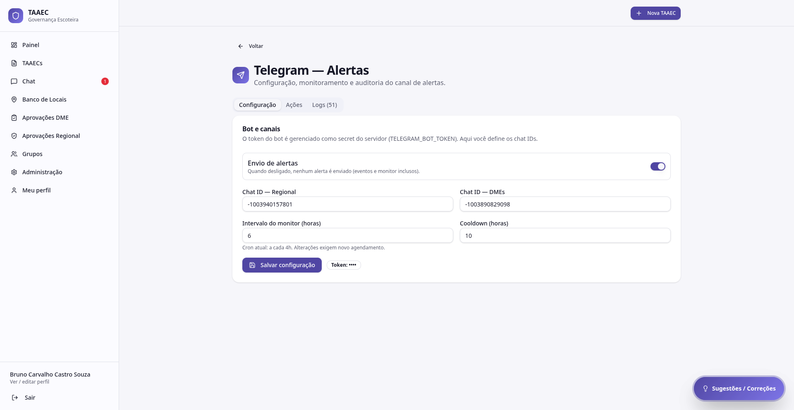
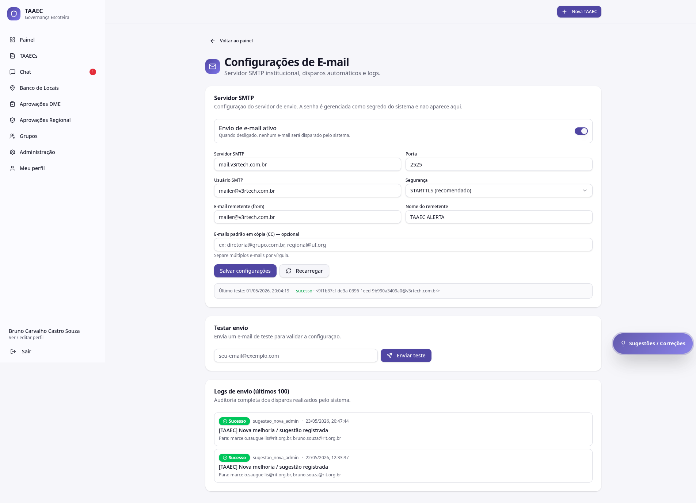

# Notificações (Telegram & E-mail)

O TAAEC tem **dois canais de notificação automatizada**: **Telegram** (alertas críticos para o Admin Mestre) e **E-mail institucional** (notificações ao DME, Admin, grupos convidados).

Esta página agrupa as duas configurações administrativas.

---

## Telegram

Tela **Administração → Telegram (Alertas)**.

### Quem acessa

- **Admin Mestre** (exclusivo)

### O que se configura

| Item | O que define |
|---|---|
| **Bot Token** | Token do bot Telegram (`TELEGRAM_BOT_TOKEN`) — variável de ambiente Supabase |
| **Chat ID** | ID do chat / canal de destino (`TELEGRAM_CHAT_ID`) |
| **Webhook secret** | Segredo do webhook autenticado (`webhook_secret` em `telegram_config`) |
| **Cooldown** | Intervalo mínimo entre alertas para evitar flood |
| **Monitor inteligente** | Regras de agregação (ex: agrupar 3 alertas em 5 min em uma só mensagem) |
| **Logs de envio** | Registro de cada notificação enviada com status (ok / falha) |

### Eventos que disparam Telegram

- Nova TAAEC submetida (risco elevado)
- Alertas de segurança (tentativas de acesso indevido)
- Reprovação de TAAEC pela Regional
- Mudanças críticas de parametrização

### Segurança

- O **webhook é autenticado** via `webhook_secret` + header `x-secreto-interno`
- Requisições não autenticadas são **rejeitadas** pela Edge Function `send-telegram-alert`
- O **destino do chat fica restrito** ao Admin Mestre (não dá para reaproveitar o bot para outros chats)

!!! warning "Não compartilhe o token"
    O Bot Token concede controle total do bot. Compartilhar expõe o canal a flood ou spoof. Se o token vazar, **rotacione imediatamente** no BotFather e atualize a variável de ambiente.

---

## E-mail institucional

Tela **Administração → E-mail Institucional**.

### Quem acessa

- **Admin Mestre** (exclusivo)

### O que se configura

| Item | O que define |
|---|---|
| **SMTP_HOST** | Servidor de e-mail (ex: `smtp.sendgrid.net`) |
| **SMTP_PORT** | Porta (587 padrão para TLS) |
| **SMTP_USER** | Usuário SMTP |
| **SMTP_PASS** | Senha SMTP |
| **E-mail do remetente** | De qual endereço sai a notificação |
| **Disparo automático** | Liga/desliga o envio ao final do fluxo de TAAEC |
| **Logs** | Status de cada envio (sucesso, bounce, falha) |
| **Reenvio manual** | Reenviar um e-mail específico em caso de falha |

### Eventos que disparam e-mail

- **Nova TAAEC criada** → DME do grupo anfitrião (função `notificarDmeNovaTaaec`)
- **Nova sugestão recebida** → Admin Mestre (função `notificarAdminNovaSugestao`)
- **TAAEC enviada à Regional** → equipe Regional
- **Decisão da Regional** → Responsável + DME
- **TAAEC multigrupo** → DME do(s) grupo(s) convidado(s)

### Segurança

- Funções requerem **sessão Supabase válida**
- **Verificação de propriedade** antes de qualquer disparo (você só pode notificar dentro do seu escopo de papel)
- Edge Functions rejeitam chamadas sem JWT válido

### Reenvio manual

Quando um e-mail falha (bounce, servidor temporariamente indisponível), o log marca falha. O Admin Mestre pode clicar em **Reenviar** no log para tentar de novo, sem precisar refazer a ação que disparou o envio.

---

## Por onde seguir

- **[Chat](../modulos/chat.md)** — comunicação interna que complementa as notificações
- **[Sugestões](../modulos/sugestoes.md)** — canal de feedback que dispara notificação por e-mail ao Admin Mestre

---

## Funcionalidades previstas

Versões futuras devem trazer:

- **Interface para SMTP** com teste de envio direto (hoje configurado por variáveis de ambiente)
- **Preferências de notificação por usuário** (escolher canais e tipos de evento)
- **Templates editáveis** para os e-mails de fluxo
- **Webhook configurável** para integração com outras ferramentas (Slack, Discord)
