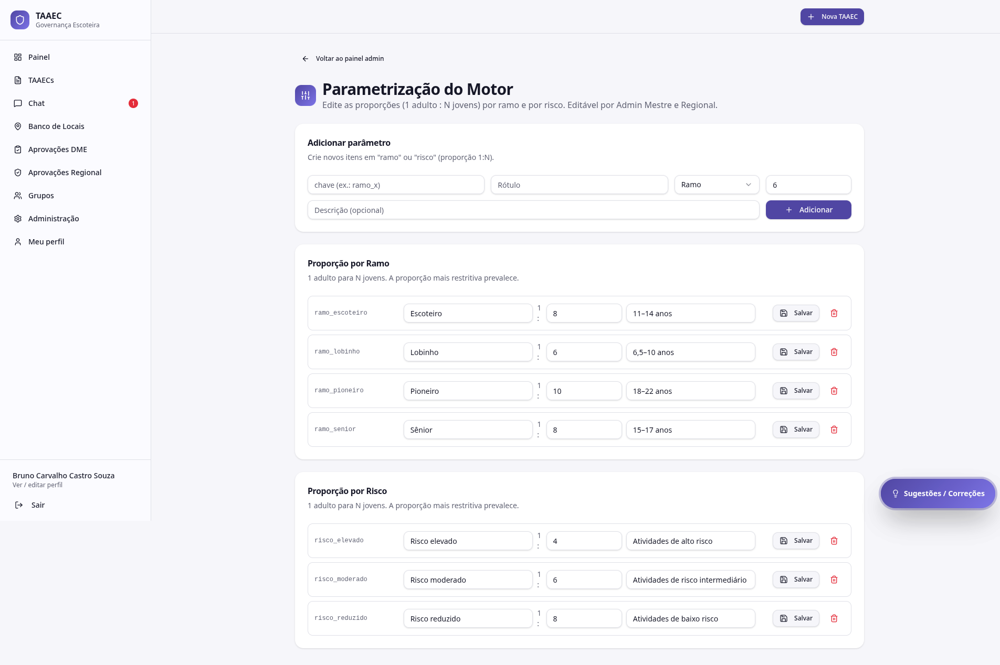

# Parametrização do motor

A tela **Parametrização do Motor** é onde Admin Mestre e Regional definem as **regras institucionais** que o [motor de risco](../modulos/motor-de-risco.md) aplica no cálculo das TAAECs.

---

## Quem acessa

- **Admin Mestre**
- **Regional**

---

## O que se configura

### Tabela de proporção por **ramo**

Quantos jovens por adulto escotista cada ramo permite no máximo:

| Ramo | Padrão atual |
|---|---|
| Lobinho (6,5–10 anos) | 1 : 5 |
| Escoteiro (11–14 anos) | 1 : 7 |
| Sênior (15–17 anos) | 1 : 8 |
| Pioneiro (18–22 anos) | 1 : 10 |

### Tabela de proporção por **risco**

Quantos jovens por adulto cada classificação de risco permite:

| Risco | Padrão atual |
|---|---|
| Reduzido | 1 : 8 |
| Moderado | 1 : 6 |
| Elevado | 1 : 4 |

### Tabelas detalhadas (jovens × adultos × ramo × risco)

Quadros que cruzam volumes (6, 12, 18, 24, 30, 36 jovens) por ramo e risco, mostrando o **mínimo absoluto de adultos** exigido. O motor sempre aplica a regra **mais restritiva**.

### Mínimo absoluto

Mesmo em atividades muito pequenas, o mínimo é **2 adultos escotistas** — não pode ficar abaixo disso.

### Pesos dos fatores

Quanto cada fator soma ao score:

- Pernoite: +15
- Lobinho presente: +10
- Atividade aquática: +X
- Distância do hospital > 30 km: +X
- ... (lista completa parametrizada)

### Regras críticas de override

Condições que bloqueiam aprovação independentemente do score:

- Atividade aquática **sem salva-vidas certificado**
- Atividade fora de área urbana **sem primeiro socorrista**
- **PAXTU não anexado**
- **Plano de Segurança não anexado**
- Proporção adulto:jovem **abaixo do mínimo** para o ramo

---

## Como mudanças se propagam

Mudanças na parametrização **valem para TAAECs criadas a partir do momento da alteração**. TAAECs antigas mantêm sua classificação original até que alguém clique em **Reanalisar com o motor** no detalhe da TAAEC.

!!! warning "Mudança de parametrização é decisão institucional"
    Alterar pesos ou proporções afeta **todas as TAAECs novas**. Antes de mudar, alinhe com a equipe responsável (UEB, Diretoria Regional) — a parametrização inicial reflete diretrizes oficiais escoteiras. Mudanças não-coordenadas podem gerar inconsistência regulatória.

---

## Boas práticas

- **Registre cada mudança** com data, justificativa e responsável (em ata ou no audit log com comentário)
- **Teste no modo TESTE** antes de aplicar definitivo — crie uma TAAEC de teste com a parametrização nova para ver o efeito
- **Comunique** mudanças a DMEs antes de aplicar — evita surpresa quando a próxima TAAEC sair com proporção diferente da esperada
- **Reanalise** TAAECs ativas relevantes (já aprovadas mas não realizadas) se a mudança de regra for crítica

---

## Por onde seguir

- **[Motor de risco](../modulos/motor-de-risco.md)** — como as regras configuradas aqui são aplicadas
- **[Catálogo de atividades](catalogo.md)** — definição de atividades pré-cadastradas e seus riscos
