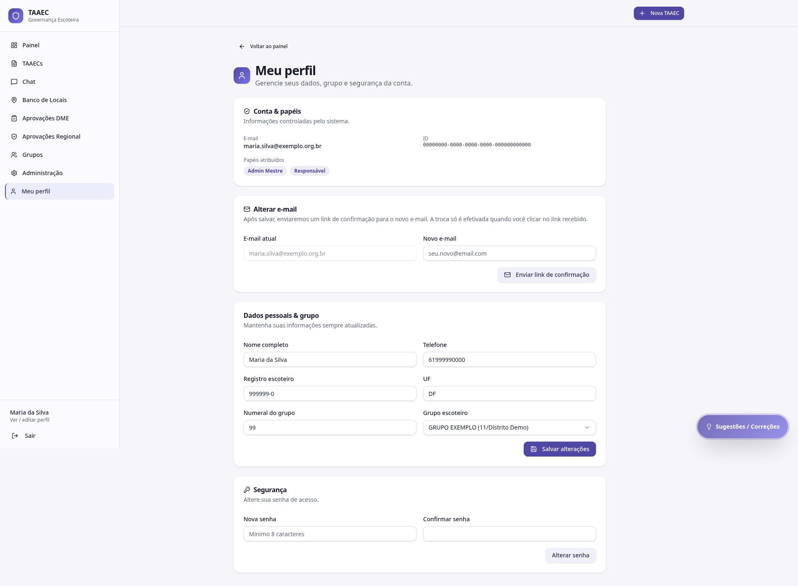

# Meu perfil

A tela **Meu perfil** centraliza seus dados pessoais, vínculo de grupo, papéis atribuídos e segurança da conta.

---

## Cabeçalho

- **Voltar ao painel**
- **Meu perfil** (título) + descrição: "Gerencie seus dados, grupo e segurança da conta."

---

## Conta & papéis

Bloco superior com informações **controladas pelo sistema** (não editáveis):

| Campo | Conteúdo |
|---|---|
| **E-mail** | Seu e-mail principal de login (ex: `maria.silva@exemplo.org.br`) |
| **ID** | Identificador único do seu usuário no banco (UUID) |
| **Papéis atribuídos** | Lista de papéis ativos (ex: *Admin Mestre*, *Responsável*) |

!!! info "Por que o ID aparece"
    O ID interno (UUID) é útil para reportar problemas — em alguns casos a administração pede esse ID para investigar comportamentos específicos da sua conta no audit log. Você não precisa decorar; está aqui para copiar quando necessário.

---

## Alterar e-mail

Mudar o e-mail principal exige confirmação no novo endereço — proteção contra captura indevida da conta.

- **E-mail atual** (somente leitura)
- **Novo e-mail** (digitar)
- Botão **Enviar link de confirmação**

> Após salvar, enviaremos um link de confirmação para o novo e-mail. A troca só é efetivada quando você clicar no link recebido.

!!! warning "E-mail vinculado ao Google"
    Se você entra com **Google OAuth**, mudar o e-mail aqui muda só o e-mail de notificação interna do TAAEC; o vínculo OAuth continua com a conta Google original. Para trocar a conta Google, faça logout, entre com a nova conta Google e peça ao Admin Mestre para migrar seus papéis.

---

## Dados pessoais & grupo

Bloco editável:

| Campo | Editável | Observação |
|---|---|---|
| Nome completo | ✅ | Como aparece na assinatura institucional |
| Telefone | ✅ | Sem máscara |
| Registro escoteiro | ✅ | Formato com hífen (ex: 999999-0) |
| UF | ✅ | Sigla |
| Numeral do grupo | ✅ | Número do GE |
| Grupo escoteiro | ✅ | Combo com os grupos cadastrados |

Botão **Salvar alterações** ao final.

!!! tip "Atualizar quando mudar de grupo"
    Se você se transferir para outro grupo escoteiro, atualize **Numeral** + **Grupo** aqui. Isso garante que suas TAAECs novas saiam vinculadas ao grupo correto. Para mover TAAECs antigas, peça suporte ao Admin Mestre.

---

## Segurança

Bloco para **alterar senha** local (não afeta login via Google):

- Nova senha (mínimo 8 caracteres)
- Confirmar senha
- Botão **Alterar senha**

Senhas são armazenadas com hash — nem o Admin Mestre consegue ver sua senha.

---

## O que NÃO está aqui

- **Atribuição de papéis** — você não atribui papéis a si mesmo. Quem faz isso é o Admin Mestre, Regional, Admin do Grupo ou Presidente, em [Usuários & Papéis](usuarios-papeis.md)
- **Excluir conta** — solicitação de exclusão é processada pela administração; envie pela ferramenta de [Sugestões](../modulos/sugestoes.md) com tipo *Exclusão de conta*
- **Configurações de notificação** — atualmente as notificações automáticas são definidas por papel (DME, Admin Mestre). Preferências individuais por canal estão previstas em versões futuras
