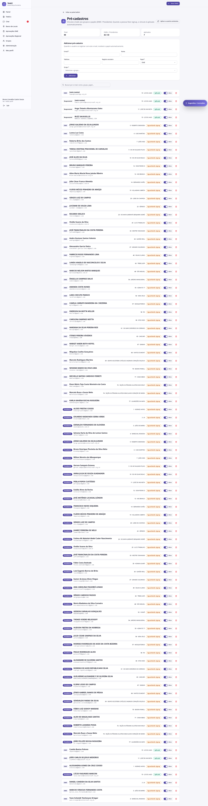

# Pré-cadastros (DME / Presidente)

A tela **Pré-cadastros** permite vincular **e-mail + grupo + papel** **antes** que a pessoa se cadastre no TAAEC. Quando ela faz o primeiro signup, o sistema aplica automaticamente o papel.



---

## Quem acessa

- **Admin Mestre**
- **Regional**

---

## Por que usar

Sem pré-cadastro, o fluxo é:

```
Pessoa se cadastra → Admin vê novo usuário no painel → Atribui papel manualmente
```

Com pré-cadastro:

```
Admin cria pré-cadastro (e-mail + papel + grupo) → Pessoa se cadastra → Sistema aplica papel automaticamente
```

Vantagens:

- A pessoa **já entra com permissão** — não fica esperando
- **Reduz erro humano** — você define o papel **antes** de ver a tela cheia de novos usuários
- **Acelera onboarding** — útil quando um lote de novos DMEs vai entrar (ex: início de ano)

---

## Como criar um pré-cadastro

1. Acesse **Administração → Pré-cadastros**
2. Clique em **Novo pré-cadastro**
3. Preencha:

   | Campo | Exemplo | Observação |
   |---|---|---|
   | E-mail | `dme@gejaonline.org` | E-mail que a pessoa usará para se cadastrar |
   | Grupo | 11 — JOSÉ DE ANCHIETA | Grupo ao qual o papel se vincula |
   | Papel | DME | Papel a aplicar no signup |
   | Observação | "DME 2026 — substituto do João" | Opcional, ajuda triagem |

4. Salve

A pessoa pode então se cadastrar normalmente (via Google ou e-mail/senha) — o sistema reconhece o e-mail, aplica o papel e o grupo, e o painel já carrega populado.

---

## Estados de um pré-cadastro

| Estado | Significado |
|---|---|
| **Pendente** | Criado, ainda não consumido (pessoa não se cadastrou) |
| **Aplicado** | Pessoa se cadastrou e o papel foi atribuído |
| **Expirado** | (Quando aplicável) — passou prazo de validade sem signup |
| **Revogado** | Admin cancelou antes do signup |

---

## Editar / revogar um pré-cadastro

Enquanto **pendente**, você pode:

- **Editar** — mudar grupo, papel ou observação
- **Revogar** — cancelar (a pessoa pode se cadastrar, mas sem papel atribuído)

Após **aplicado**, mudanças passam a ser feitas em [Usuários & Papéis](usuarios-papeis.md).

---

## Casos de uso típicos

- **Início do ano escoteiro**: criar pré-cadastros para todos os DMEs novos, sem precisar correr atrás depois
- **Substituição de papel**: novo Presidente vai assumir em data X; pré-cadastro garante que ele já entra com o papel certo
- **Migração de grupo**: chefe se transferiu; revogar pré-cadastro antigo (se ainda pendente) e criar novo com o grupo correto

!!! tip "Use o e-mail que a pessoa realmente vai usar"
    Se a pessoa usa Google OAuth com `@gmail.com`, cadastre esse e-mail — não o e-mail institucional. O TAAEC casa por endereço exato; um pré-cadastro em `@rit.org.br` não casa com signup feito em `@gmail.com`.

---

## Por onde seguir

- **[Usuários & Papéis](usuarios-papeis.md)** — gerenciar atribuições depois do signup
- **[Papéis e permissões](../guia/papeis.md)** — o que cada papel pode fazer
