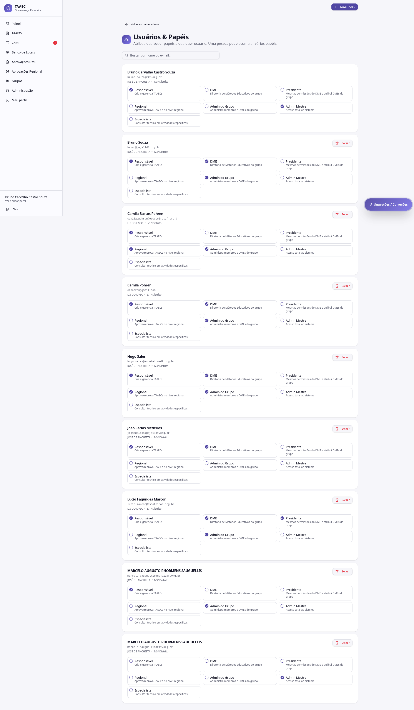

# Usuários & Papéis

A tela **Usuários & Papéis** é o centro de governança de quem-pode-o-quê no TAAEC: lista todos os usuários, com seus papéis ativos, e permite **atribuir** ou **revogar** papéis institucionais.

---

## Quem acessa

- **Admin Mestre** — qualquer usuário, qualquer papel, qualquer grupo
- **Admin de Grupo** / **Presidente** — apenas usuários e papéis do próprio grupo

---

## Papéis que podem ser atribuídos

| Papel | Quem pode atribuir |
|---|---|
| **Responsável** | Admin Mestre / Admin Grupo / Presidente |
| **DME** | Admin Mestre / Admin Grupo / Presidente |
| **Presidente** | Admin Mestre / Regional |
| **Regional** | Admin Mestre |
| **Especialista** | Admin Mestre / Regional |
| **Admin (de Grupo)** | Admin Mestre |
| **Admin Mestre** | Admin Mestre (operação sensível, com confirmação dupla) |

Detalhe do que cada papel significa em [Papéis e permissões](../guia/papeis.md).

---

## Estrutura da tela

Para cada usuário, a tela tipicamente exibe:

| Coluna | Conteúdo |
|---|---|
| Nome | Nome completo do usuário |
| E-mail | E-mail principal de login |
| Grupo | Numeral + nome do grupo escoteiro |
| Papéis ativos | Lista de tags com os papéis atribuídos |
| Ações | Atribuir / revogar papel · Editar · Ver detalhes |

Há filtros por **grupo**, **papel** e **busca por nome / e-mail**.

---

## Atribuir um papel

1. Localize o usuário (busca ou filtro)
2. Em **Ações**, escolha **Atribuir papel**
3. Selecione o papel
4. (Quando aplicável) selecione o **grupo** ao qual o papel se aplica
5. Confirme

A atribuição é validada server-side e registrada no audit log com:

- Quem atribuiu
- Quem recebeu
- Qual papel
- Em qual grupo (se aplicável)
- Timestamp

---

## Revogar um papel

1. Localize o usuário
2. Na lista de papéis, clique no **X** ao lado do papel
3. Confirme a revogação

A revogação **não exclui o usuário** — apenas remove o papel. O usuário continua existindo, mas perde as permissões associadas.

!!! warning "Cuidado com auto-revogação"
    Um Admin Mestre não deve revogar o próprio papel sem garantir que **outro Admin Mestre** continue ativo no sistema. Se restar zero Admin Mestre, partes da administração ficam inacessíveis até intervenção técnica.

---

## Boas práticas

- **Use Pré-cadastro** sempre que possível: vincula papel ao e-mail **antes** do signup, evitando ter que atribuir manualmente depois. Ver [Pré-cadastros](pre-cadastros.md).
- **Princípio do menor privilégio**: atribua só o papel necessário para a função. Um chefe que não vai aprovar TAAECs não precisa de DME.
- **Revise periodicamente**: pessoas saem do grupo, mudam de função — uma rotina semestral de revisão evita acúmulo indevido de permissões.
- **Documente decisões**: ao atribuir Admin Mestre ou Regional (papéis sensíveis), registre o motivo no campo de observação (quando disponível) ou em ata.

---

## Por onde seguir

- **[Pré-cadastros](pre-cadastros.md)** — atribuição antecipada de papel
- **[Papéis e permissões](../guia/papeis.md)** — o que cada papel pode fazer
- **[Administração](administracao.md)** — outros recursos administrativos
