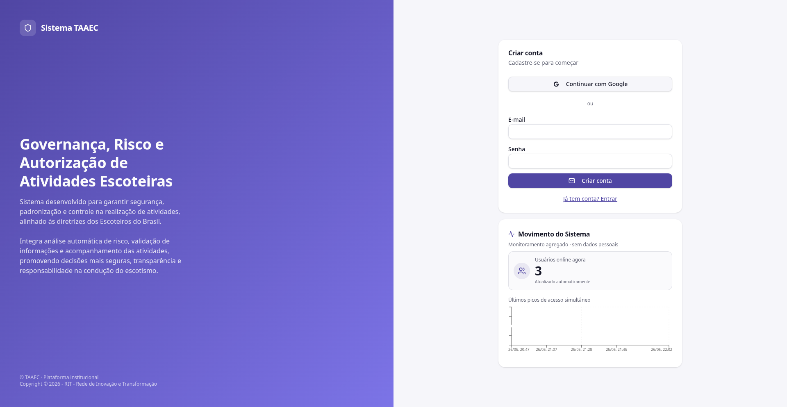

# Primeiros passos

Este guia leva você do **primeiro acesso** até estar pronto para criar ou aprovar TAAECs.

---

## 1. Acessar o sistema

Abra [taaec.escoteirosdf.org.br](https://taaec.escoteirosdf.org.br/) no navegador. A tela inicial mostra o painel de login à direita e um indicador em tempo real do **movimento do sistema** (usuários online agora e gráfico dos últimos picos de acesso — monitoramento agregado, sem dados pessoais).

Você tem duas opções de login:

- **Continuar com Google** — recomendado. Login OAuth com a sua conta Google institucional ou pessoal
- **E-mail e senha** — credencial local cadastrada no próprio TAAEC

!!! tip "Por que preferir o Google"
    O login Google dispensa lembrar mais uma senha e mantém sua sessão alinhada ao mesmo provedor que você provavelmente já usa para o PAXTU e para o e-mail escoteiro. Se a sua conta Google muda, a sessão TAAEC acompanha sem precisar de reset de senha.

---

## 2. Criar conta (se ainda não tem)

Na tela de login, clique em **Não tem conta? Cadastre-se**. O formulário troca para o modo de cadastro:

Pode usar Google (cria a conta na primeira tentativa de login) ou preencher e-mail + senha. Após o primeiro login, o sistema **bloqueia o acesso até você completar o cadastro escoteiro**.

---

## 3. Completar o cadastro escoteiro

Acesse **Meu perfil** no menu lateral. Preencha:

| Campo | Exemplo | Observação |
|---|---|---|
| Nome completo | Maria da Silva | Como aparece no registro |
| Telefone | 61999990000 | Sem máscara, só números |
| Registro escoteiro | 999999-0 | Formato com hífen |
| UF | DF | Sigla |
| Numeral do grupo | 11 | Número do GE |
| Grupo escoteiro | GRUPO EXEMPLO (99/Distrito Demo) | Selecione na lista |

Clique em **Salvar alterações**.

!!! warning "Cadastro incompleto = acesso bloqueado"
    Enquanto o cadastro estiver incompleto, o sistema bloqueia o acesso às demais funcionalidades. O painel só carrega depois que todos os campos obrigatórios estiverem preenchidos.

---

## 4. Aguardar atribuição de papel

Acabou de se cadastrar e o sistema parece "vazio"? É esperado. Você recebe o **papel inicial** quando:

- O **Admin Mestre** ou um **Admin do seu grupo** te atribui o papel manualmente em [Administração → Usuários & Papéis](../configuracoes/usuarios-papeis.md); **ou**
- Seu e-mail estava em **Pré-cadastros** com papel definido. Nesse caso, o papel é aplicado automaticamente no primeiro signup

Os papéis disponíveis (e o que cada um vê) estão descritos em [Papéis e permissões](papeis.md).

---

## 5. Conhecer o painel

Com o papel atribuído, o **Painel** mostra:

- **Cards de status** das TAAECs (em construção, ativas, aprovadas, reprovadas)
- **Dashboard de risco** por classificação (reduzido / moderado / elevado)
- **Atividades recentes** do seu grupo / ecossistema
- **Versão do sistema** com novidades da release atual
- **Ações rápidas** com atalhos para nova TAAEC, aprovações, anuências, visão geral e administração

Detalhe completo em [Painel](../modulos/painel.md).

---

## 6. Próximos passos por papel

| Papel | Para onde ir agora |
|---|---|
| **Responsável** pela atividade | [TAAECs → Nova TAAEC](../modulos/taaecs.md#criar-uma-nova-taaec) e preencha o wizard |
| **DME do grupo anfitrião** | [Aprovações DME](../modulos/aprovacoes.md#aprovacoes-dme) para analisar a fila |
| **DME do grupo convidado** | [Anuências](../modulos/anuencias.md) para lançar dados do seu grupo |
| **Regional / Admin Mestre** | [Aprovações Regional](../modulos/aprovacoes.md#aprovacoes-regional) e [Visão Geral](../modulos/visao-geral.md) |
| **Admin Mestre** (configurar) | [Administração](../configuracoes/administracao.md) para parametrizar o sistema |

---

## Dúvidas comuns no primeiro acesso

- **"Fiz login mas não vejo nada"** — cadastro incompleto ou papel ainda não atribuído. Veja seções 3 e 4 acima.
- **"Não tenho certeza do meu numeral / nome do grupo"** — pergunte na Diretoria do grupo ou consulte o PAXTU.
- **"Não recebo notificações"** — verifique se seu e-mail está correto em **Meu perfil** e se o Telegram está configurado para alertas críticos (somente Admin Mestre).
- **"Preciso trocar de e-mail"** — em **Meu perfil → Alterar e-mail**, informe o novo endereço. A troca só é efetivada quando você clica no link enviado para o novo e-mail.
