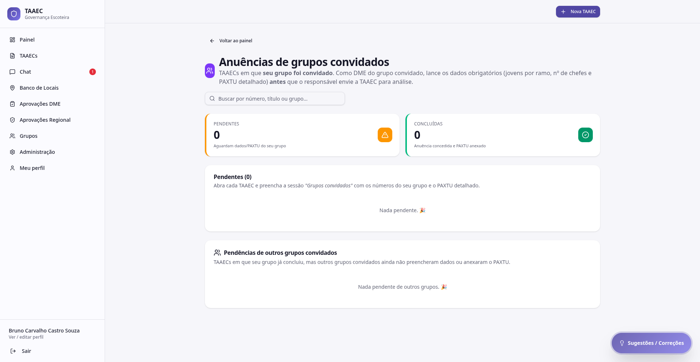

# Anuências de grupos convidados

A tela **Anuências** mostra TAAECs em que **seu grupo foi convidado** por outro grupo escoteiro. Como DME do grupo convidado, você precisa lançar os dados obrigatórios — **jovens por ramo, número de chefes e PAXTU detalhado** — **antes** que o Responsável da TAAEC envie para análise da DME.



---

## Por que existe

Em atividades **multigrupo** (acampamento conjunto, atividade interdistrital), cada grupo participante tem sua própria estrutura: número de jovens, ramos envolvidos, chefes escalados e PAXTU detalhado dos seus jovens. Sem anuência, a TAAEC ficaria incompleta — o motor não consegue calcular proporção correta sem saber quantos adultos do seu grupo virão.

A anuência é o **mecanismo formal** pelo qual o seu grupo entra na TAAEC com seus próprios números, sem que o grupo anfitrião precise adivinhar (ou estimar) por você.

---

## Cabeçalho

- **Voltar ao painel** — atalho para o Painel
- Título e descrição explicativa: "Como DME do grupo convidado, lance os dados obrigatórios **antes** que o responsável envie a TAAEC para análise."
- Campo de busca por número, título ou grupo

---

## Cards de contagem

Dois cards superiores:

| Card | Significado |
|---|---|
| **Pendentes** | TAAECs que aguardam dados/PAXTU do seu grupo |
| **Concluídas** | TAAECs em que sua anuência já foi concedida e o PAXTU anexado |

---

## Lista de pendentes

Abaixo dos cards aparece a lista **Pendentes (N)** com instrução:

> Abra cada TAAEC e preencha a sessão *"Grupos convidados"* com os números do seu grupo e o PAXTU detalhado.

Cada item é uma TAAEC em que você ainda precisa agir. Clicar abre o detalhe da TAAEC, com a seção **Grupos convidados** já posicionada para preenchimento.

Quando não há nada pendente, aparece: **"Nada pendente. 🎉"**

---

## Pendências de outros grupos convidados

Card adicional, abaixo da lista de pendentes:

> TAAECs em que seu grupo **já concluiu**, mas outros grupos convidados ainda não preencheram dados ou anexaram o PAXTU.

Útil para o DME do grupo convidado **acompanhar** o status sem precisar agir — você cumpriu a sua parte; o gargalo está em outro grupo.

---

## O que preencher na anuência

Ao abrir a TAAEC, na seção **Grupos convidados**, lance:

| Campo | Tipo | Obrigatório |
|---|---|---|
| Lobinhos (6,5–10) do seu grupo | Número | Sim (se houver) |
| Escoteiros (11–14) do seu grupo | Número | Sim (se houver) |
| Sêniores (15–17) do seu grupo | Número | Sim (se houver) |
| Pioneiros (18–22) do seu grupo | Número | Sim (se houver) |
| Nº de chefes (adultos) do seu grupo | Número | Sim |
| PAXTU detalhado do seu grupo | PDF (até 10 MB) | Sim |

Após salvar, sua anuência fica **Concluída** e seu grupo desaparece das pendências.

---

## Fluxo completo (multigrupo)

```
Responsável cria TAAEC ──► Convida grupos (multigrupo)
                              │
                              ▼
                      DMEs dos grupos convidados
                      preenchem ANUÊNCIA
                              │
                              ▼
                      Responsável submete à DME
                      (só habilitado quando todas
                       as anuências estão prontas)
                              │
                              ▼
                      DME anfitriã analisa
                              │
                              ▼
                      Regional dá parecer final
```

!!! warning "Sem anuência, o Responsável não consegue submeter"
    O botão **Enviar para DME** no wizard fica **desabilitado** enquanto algum grupo convidado tiver pendência. Isso é proposital: garante que a estrutura total da atividade esteja conhecida antes da análise institucional.

---

## Por onde seguir

- **[TAAECs → Wizard](taaecs.md#criar-uma-nova-taaec)** — quem cria uma TAAEC multigrupo (Responsável) ativa o switch *Multi-grupo* e adiciona os grupos convidados
- **[Aprovações DME](aprovacoes.md#aprovacoes-dme)** — etapa seguinte, depois que todas as anuências estão prontas
- **[Visão Geral](visao-geral.md)** — onde a TAAEC multigrupo aparece com o status agregado de todos os grupos
