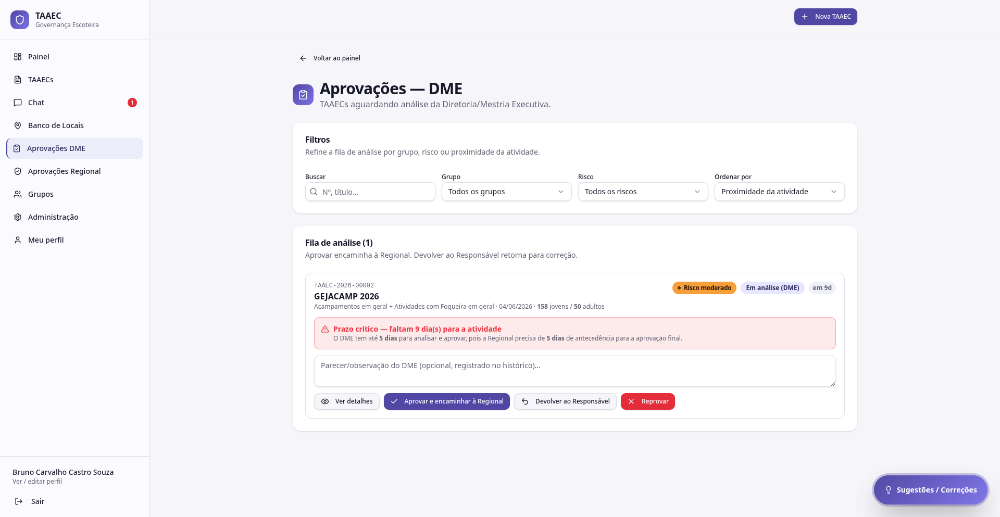
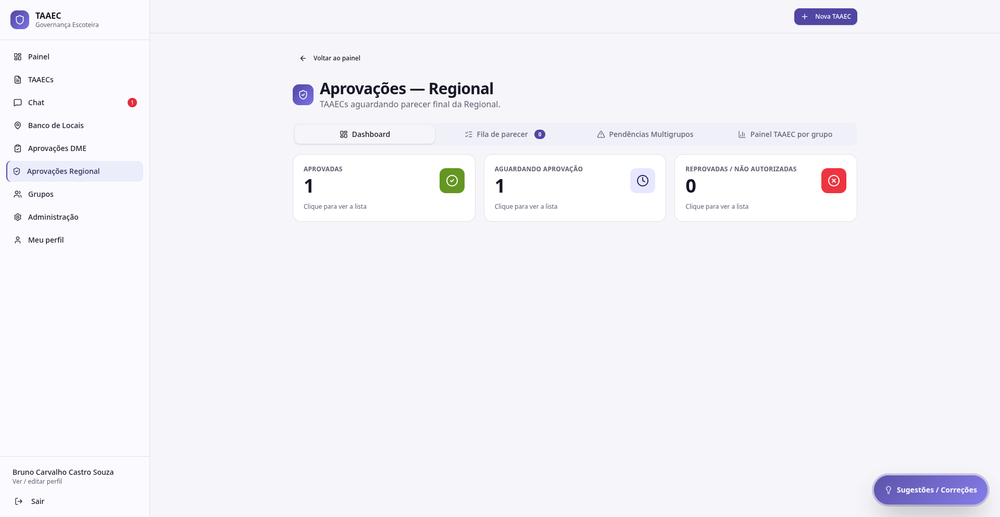

# Aprovações (DME e Regional)

O TAAEC tem **duas etapas de aprovação institucional**, em sequência:

```
Responsável submete  →  DME do grupo anfitrião analisa  →  Regional dá parecer final
                          (devolve / aprova / reprova)        (aprova / reprova)
```

Cada etapa tem sua própria fila e tela, descritas abaixo.

!!! info "Risco BAIXO encerra no DME"
    A partir da versão 1.4.0, TAAECs com risco **reduzido** são encerradas automaticamente na etapa DME — **não vão à Regional**. Isso desafoga a Regional para focar em risco moderado e elevado.

---

## Aprovações DME

Fila de TAAECs aguardando análise da **Diretoria/Mestria Executiva** do grupo anfitrião.



### Filtros

Bloco superior **Filtros** com quatro controles para refinar a fila:

- **Buscar** — por número ou título da TAAEC
- **Grupo** — selecione o grupo escoteiro
- **Risco** — reduzido / moderado / elevado
- **Ordenar por** — proximidade da atividade (padrão), data de submissão, etc.

### Lista de análise

Cada item mostra:

- **Código** + **título** + **atividades selecionadas** + **data**
- **Total de jovens / adultos** (em destaque)
- **Tag de risco** + status atual + **prazo** ("em 9d", "em 4d", etc.)
- **Alerta de prazo crítico** quando faltam poucos dias para a atividade
- Campo para **parecer / observação do DME** (opcional, registrado no histórico)
- Botões de ação

### Alerta de prazo

Quando faltam poucos dias para a atividade, o sistema exibe um alerta amarelo:

> ⏰ **Prazo crítico — faltam 9 dia(s) para a atividade**
>
> O DME tem até **5 dias** para analisar e aprovar, pois a Regional precisa de **5 dias** de antecedência para a aprovação final.

A intenção é: o tempo da Regional é fixo; o seu tempo (DME) encolhe à medida que a data da atividade se aproxima.

### Ações disponíveis

| Ação | Efeito |
|---|---|
| **Ver detalhes** | Abre o detalhe completo da TAAEC |
| **Aprovar e encaminhar à Regional** | Aprova nesta etapa; segue para Regional (ou encerra se for risco baixo) |
| **Devolver ao Responsável** | Retorna para correção, **sem reprovar**. O Responsável edita e reenvia |
| **Reprovar** | Rejeita definitivamente. O Responsável precisa criar nova TAAEC se quiser |

A **observação do DME** digitada no campo é registrada no histórico junto com a ação.

---

## Aprovações Regional

Tela com **abas** para diferentes recortes do trabalho da Regional.



### Aba Dashboard

Três cards clicáveis com contagens globais:

| Card | O que abre |
|---|---|
| **Aprovadas** | Lista das TAAECs com parecer favorável da Regional |
| **Aguardando aprovação** | Fila de TAAECs com parecer DME positivo, aguardando Regional |
| **Reprovadas / Não autorizadas** | Histórico de rejeições |

### Aba Fila de parecer

Lista das TAAECs em **análise Regional** com filtros próprios e ações:

- **Aprovar** — autoriza a atividade. Notifica DME, Responsável e grupos
- **Devolver ao DME** — pede revisão prévia da DME antes do parecer final
- **Reprovar** — rejeita com justificativa

### Aba Pendências Multigrupos

Lista TAAECs **multigrupo** que ainda têm anuências pendentes de algum grupo convidado. A Regional usa para detectar quem está segurando o processo.

### Aba Painel TAAEC por grupo

Visão consolidada de **quantas TAAECs cada grupo tem em cada estado**. Útil para identificar grupos com gargalo (ex: muitas em construção há semanas, sem submissão).

---

## Diferenças entre DME e Regional

| Item | DME | Regional |
|---|---|---|
| Quem age | DME do grupo anfitrião | Regional / Admin Mestre |
| O que faz | Anuência da estrutura e completude | Parecer final institucional |
| Pode devolver? | ✅ ao Responsável | ✅ ao DME |
| Pode reprovar? | ✅ | ✅ |
| Vê dashboard agregado? | — | ✅ (4 abas) |
| Risco baixo | Encerra aqui | Não chega |
| Risco moderado | Encaminha | Decide |
| Risco elevado | Encaminha (alerta) | Decide (com rigor) |

---

## Por onde seguir

- **[Visão Geral](visao-geral.md)** — onde cada TAAEC está parada, em todos os grupos
- **[Anuências](anuencias.md)** — fluxo dos grupos convidados (etapa anterior à DME)
- **[Motor de risco](motor-de-risco.md)** — entenda os indicadores que aparecem em cada item da fila
