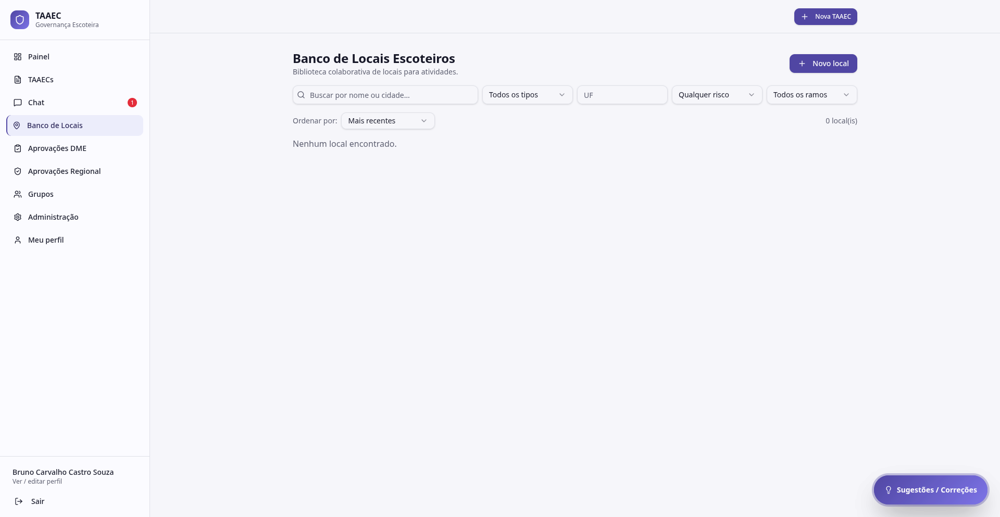

# Banco de Locais Escoteiros

O **Banco de Locais** é a biblioteca colaborativa de **locais para atividades** — pontos previamente conhecidos pela comunidade escoteira da Regional DF, com informações úteis para planejamento.

---

## Para que serve

Ao planejar uma atividade, em vez de descrever um local "do zero" no wizard da TAAEC, você pode **consultar o banco** para encontrar locais já catalogados: chácaras, parques, sítios, áreas de canoagem, espaços urbanos, etc. — com histórico de uso e classificação de risco padrão associada.

Os locais são **adicionados pela comunidade** (qualquer usuário com permissão pode cadastrar um local novo). Isso transforma conhecimento individual ("o sítio Alegria é ótimo para acampamento de Lobinhos") em ativo coletivo da Regional.

---

## Cabeçalho

- **Banco de Locais Escoteiros** (título)
- Descrição: "Biblioteca colaborativa de locais para atividades"
- Botão **Novo local** — abre o cadastro de um local novo (rota `/locais/novo`)

---

## Busca e filtros

Linha de filtros logo abaixo:

| Filtro | Opções |
|---|---|
| **Busca** | Texto livre (nome ou cidade) |
| **Tipo** | Combo: chácara, parque, área urbana, etc. |
| **UF** | Texto (ex: DF, GO) |
| **Risco** | Reduzido / Moderado / Elevado / Qualquer |
| **Ramo** | Lobinho / Escoteiro / Sênior / Pioneiro / Todos |

E uma linha de **ordenação**:

- **Mais recentes** (padrão), também por relevância, nome, etc.
- Contagem total à direita (ex: *0 local(is)*)

---

## Cadastrar um local novo

Clicar em **Novo local** abre o formulário com campos típicos:

- Nome
- Cidade / UF
- Tipo (chácara, parque, etc.)
- Coordenadas / link de mapa
- Capacidade aproximada
- **Riscos típicos** (ex: serpentes, atividade aquática)
- Anexos (fotos, croqui, contatos)
- Avaliação / comentários

Um local cadastrado fica disponível para qualquer grupo escoteiro consultar no wizard.

---

## Como o local conecta com a TAAEC

No [wizard de criação](taaecs.md#criar-uma-nova-taaec), o campo **Local** é texto livre — mas você pode digitar referenciando um local do banco (ex: *"Sítio Alegria — DF"*). Em versões futuras, está previsto um **seletor direto** que carrega o local com todos os metadados (risco padrão, capacidade, etc.).

---

## Por onde seguir

- **[TAAECs → Wizard](taaecs.md#criar-uma-nova-taaec)** — onde o local é usado
- **[Motor de risco](motor-de-risco.md)** — como o risco padrão de um local pode influenciar o cálculo
