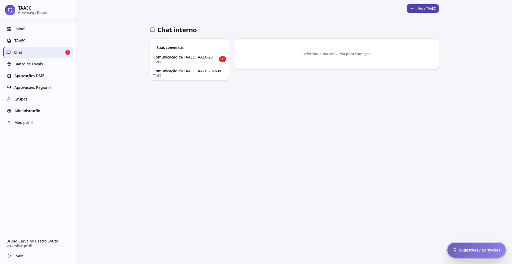
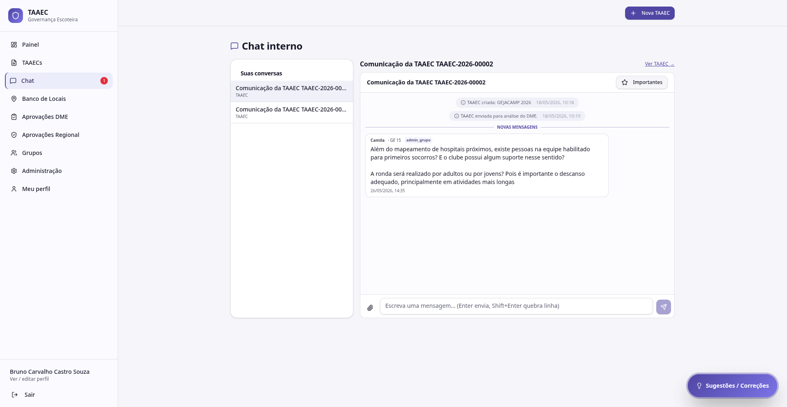

# Chat interno

O **Chat interno** centraliza, em uma única tela, **todas as conversas** das TAAECs em que você participa. É um atalho global para o bloco *Comunicação da TAAEC* que existe dentro de cada detalhe de TAAEC.

---

## Cabeçalho

- **Chat interno** (título)
- Ícone de mensagem ao lado

---

## Lista lateral — Suas conversas

À esquerda, lista das **comunicações de TAAEC** em que você está envolvido. Cada item mostra:

- Identificação da conversa (ex: *Comunicação da TAAEC TAAEC-2026-00002*)
- Tag *taaec* (identifica o tipo)
- **Badge numérico** com mensagens não lidas (se houver)

A contagem total de mensagens não lidas também aparece no item **Chat** do menu lateral principal (ex: `Chat 1`).

---

## Painel da conversa

À direita, quando você seleciona uma conversa, aparece o **fluxo completo** dela:

### O que você vê

- **Marcos automáticos do fluxo** — `TAAEC criada`, `enviada para análise do DME`, `enviada para a Regional`, `aprovada` — com timestamps
- **Mensagens das pessoas** — cada uma com nome, grupo (ex: *· GE 11*), papel (ex: *admin_grupo*) e timestamp
- **Anexos** — quando alguém anexa documento, ele aparece inline na linha do tempo

### Campo de envio

Na base da conversa:

- **Anexar arquivo** (ícone clipe)
- Campo de texto: *"Escreva uma mensagem… (Enter envia, Shift+Enter quebra linha)"*
- Botão de envio

### Botão "Importantes"

No topo da conversa, filtro **Importantes** que mostra apenas mensagens marcadas como tal. Útil quando a conversa cresceu e você quer revisitar só os pontos críticos.

---

## Quem participa de cada conversa

A comunicação de uma TAAEC reúne:

- **Responsável** (autor da TAAEC)
- **DMEs** (do grupo anfitrião e dos grupos convidados em multigrupo)
- **Grupos convidados** (admin / chefes)
- **Regional** (quando a TAAEC chega à etapa Regional)

Você só vê conversas das TAAECs em que é parte legítima — RLS no banco garante isolamento.

---

## Marcos automáticos

O sistema injeta automaticamente mensagens de marco para dar contexto cronológico:

| Marco | Quando aparece |
|---|---|
| `TAAEC criada: <título>` | No momento da criação do rascunho |
| `TAAEC enviada para análise do DME.` | Quando o Responsável clica em **Enviar para DME** |
| `TAAEC enviada para a Regional.` | Quando a DME aprova e encaminha |
| `✅ TAAEC aprovada.` | Quando a Regional dá parecer favorável |

Esses marcos não substituem o audit log — são complementares, voltados ao contexto da conversa humana.

---

## Onde mais acessar a conversa

O mesmo conteúdo da conversa aparece no **bloco "Comunicação da TAAEC"** dentro do [detalhe da TAAEC](taaecs.md#detalhe-de-uma-taaec). Ou seja:

- Use o **menu Chat** quando quer ver várias conversas e responder rapidamente
- Use o **detalhe da TAAEC** quando quer toda a TAAEC ao seu lado (resumo, motor, anexos) enquanto conversa

---

## Notificações

Mensagens novas geram notificação por:

- **E-mail** — para DME quando há novidade na TAAEC do seu grupo
- **Telegram** — alertas críticos para o Admin Mestre

Configure detalhes em [Notificações](../configuracoes/notificacoes.md).
