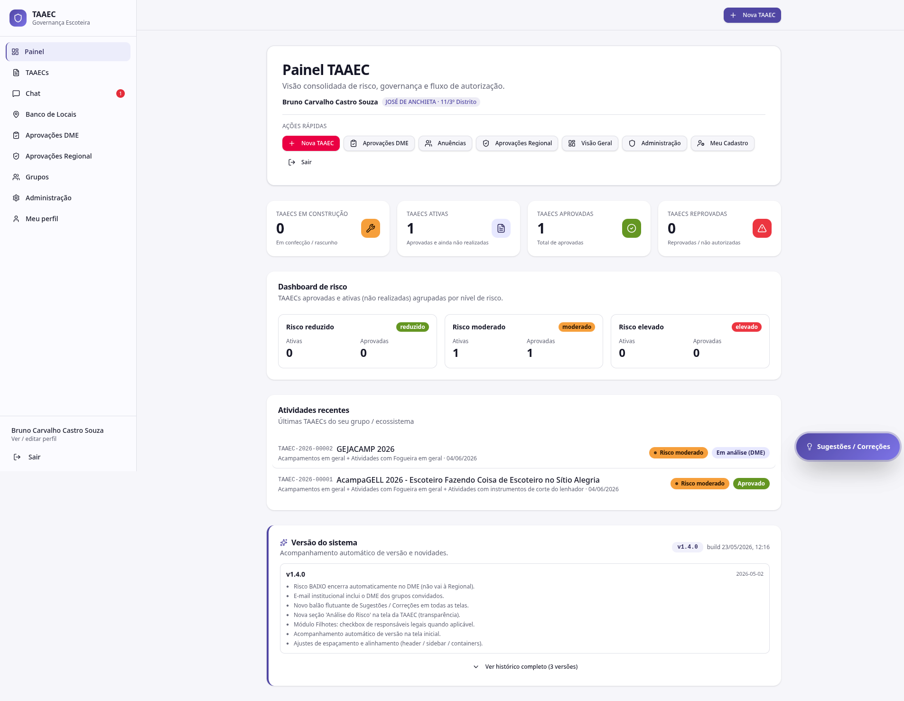

# Painel

O **Painel** é a primeira tela após o login — o cockpit consolidado da sua governança escoteira. Em uma única página você vê o status das TAAECs, o perfil de risco do ecossistema, as últimas atividades e atalhos para tudo que importa naquele momento, ajustados ao seu papel.

---

## Cabeçalho

À esquerda, o título **Painel TAAEC**, a frase "Visão consolidada de risco, governança e fluxo de autorização." e o seu nome com o grupo identificado (ex: *JOSÉ DE ANCHIETA · 11/3º Distrito*).

À direita, o bloco **Ações rápidas** com atalhos:

- **Nova TAAEC** — abre o [wizard de criação](taaecs.md#criar-uma-nova-taaec)
- **Aprovações DME** — vai para a [fila da DME](aprovacoes.md#aprovacoes-dme)
- **Anuências** — vai para [Anuências de grupos convidados](anuencias.md)
- **Aprovações Regional** — vai para o [dashboard da Regional](aprovacoes.md#aprovacoes-regional)
- **Visão Geral** — vai para [Visão Geral](visao-geral.md)
- **Administração** — vai para [Administração](../configuracoes/administracao.md)
- **Meu Cadastro** — vai para [Meu perfil](../configuracoes/perfil.md)
- **Sair** — encerra a sessão

Os atalhos exibidos dependem do seu papel (Admin Mestre vê todos; um membro vê só o essencial).

---

## Cards de status

Quatro cards no topo trazem a contagem total por estado:

| Card | Significado |
|---|---|
| **TAAECs em construção** | Rascunhos / em confecção pelo Responsável |
| **TAAECs ativas** | Aprovadas e ainda não realizadas (no calendário) |
| **TAAECs aprovadas** | Total histórico de TAAECs aprovadas |
| **TAAECs reprovadas** | Total de TAAECs reprovadas / não autorizadas |

!!! info "Ativas × Aprovadas"
    **Ativas** é um subconjunto de **Aprovadas**: contém só as que ainda não foram realizadas. Use **Ativas** para planejamento operacional do que está por vir; use **Aprovadas** para histórico institucional.

---

## Dashboard de risco

Bloco com as TAAECs **aprovadas e ativas** (não realizadas) agrupadas por nível de risco. Três faixas:

| Faixa | Cor | Contagem |
|---|---|---|
| **Risco reduzido** | Verde | Ativas / Aprovadas |
| **Risco moderado** | Amarelo | Ativas / Aprovadas |
| **Risco elevado** | Vermelho | Ativas / Aprovadas |

Útil para a Regional dimensionar acompanhamento: muitas TAAECs ativas em risco elevado pedem atenção redobrada do plantão.

---

## Atividades recentes

Lista as últimas TAAECs do seu grupo / ecossistema, com:

- **Código** (ex: TAAEC-2026-00001)
- **Título**
- **Atividades selecionadas do catálogo** + data
- **Tag de risco** (reduzido / moderado / elevado)
- **Status atual** (Em análise DME / Em análise Regional / Aprovado / Reprovado)

Clique em qualquer linha para abrir o **detalhe da TAAEC** — ver [TAAECs → Detalhe](taaecs.md#detalhe-de-uma-taaec).

---

## Versão do sistema

Bloco inferior com:

- **Versão atual** (ex: `v1.4.0`) e data do build
- **Novidades da release**: lista das mudanças mais relevantes da última versão
- Botão **Ver histórico completo** — abre o registro de todas as versões anteriores com seus respectivos itens

!!! tip "Para que serve"
    A transparência de versão dá a todos os usuários visibilidade do que mudou e quando — útil quando uma funcionalidade que você esperava encontrar ainda não foi entregue, ou quando uma melhoria recente explica uma mudança de comportamento que você notou.

---

## Balão de sugestões

No canto inferior direito da tela, em **todas as páginas**, fica o balão **💬 Sugestões / Correções**. Ele abre um diálogo onde você seleciona o tipo (sugestão, correção, etc.), descreve o problema, e o sistema **anexa automaticamente a tela atual e seu usuário**. Sua mensagem vai direto para a administração. Ver [Sugestões](sugestoes.md).

---

## Diferenças por papel

| Item | admin_mestre | regional | dme | chefe_grupo | assistente | membro |
|---|---|---|---|---|---|---|
| Cards de status | Todos os grupos | Todos os grupos | Do grupo | Do grupo | Do grupo | Do grupo |
| Dashboard de risco | Todos os grupos | Todos os grupos | Do grupo | Do grupo | Do grupo | Do grupo |
| Atividades recentes | Todas | Todas | Do grupo | Do grupo | Do grupo | Aprovadas do grupo |
| Ação **Aprovações Regional** | ✅ | ✅ | — | — | — | — |
| Ação **Administração** | ✅ | parcial | — | parcial | — | — |
