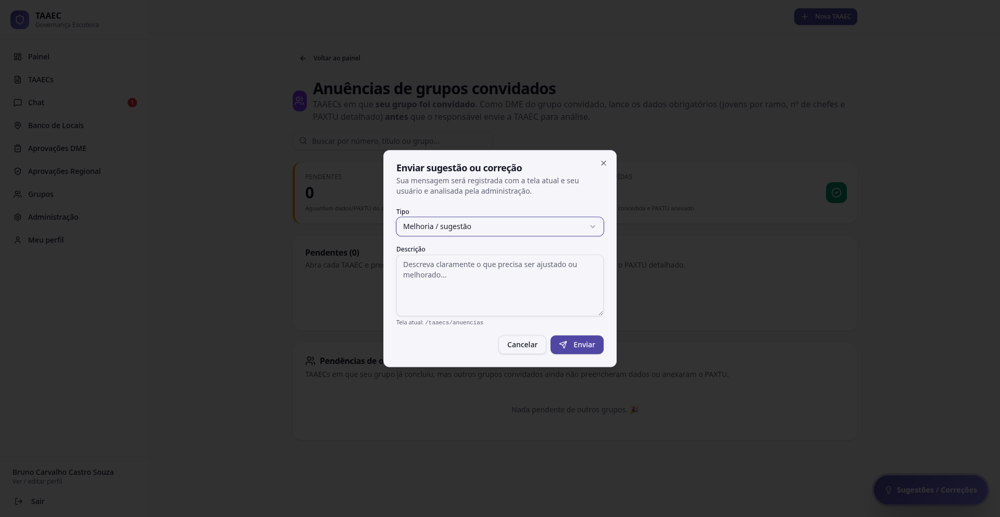

# Sugestões e correções

O sistema tem um **canal embutido de feedback** acessível em **qualquer tela**: o balão flutuante **💬 Sugestões / Correções** no canto inferior direito.

---

## Por que existe

Manuais e canais externos (e-mail, WhatsApp) sempre perdem contexto: quem reportou, em qual tela estava, qual usuário e papel. Esse canal embutido resolve isso — sua mensagem chega à administração **já identificando**:

- **A tela atual** (URL e nome lógico)
- **Seu usuário** e papel
- O **tipo** que você escolheu (melhoria, correção, dúvida)

Resultado: triagem mais rápida e correções mais precisas.

---

## Como enviar

1. Clique no balão **💬 Sugestões / Correções** (sempre visível, canto inferior direito)
2. O diálogo abre. Preencha:

   - **Tipo** — combo com opções: *Melhoria / sugestão*, *Correção / bug*, *Dúvida*, etc.
   - **Descrição** — texto livre detalhando o que precisa ser ajustado ou melhorado

3. O rodapé mostra automaticamente: *"Tela atual: `/taaecs/anuencias`"* (ou a rota em que você está)
4. Clique em **Enviar**

A mensagem vai para a fila de [Administração → Sugestões e Correções](../configuracoes/administracao.md), tratada pelo Admin Mestre e (parcialmente) pela Regional.

---

## O que acontece depois

| Etapa | Quem age | Onde aparece |
|---|---|---|
| Recebimento | Sistema | Backlog interno (Admin → Sugestões) |
| Notificação automática | Sistema | E-mail para Admin Mestre |
| Triagem | Admin Mestre / Regional | Status (Novo / Em análise / Resolvido / Rejeitado) |
| Resposta | Admin Mestre / Regional | Comentário visível para você |
| Implementação | Equipe RIT | Aparece nas novidades da próxima versão (Painel) |

!!! tip "O que escrever para acelerar a resposta"
    - **O que esperava** que acontecesse
    - **O que aconteceu** de fato (se for bug)
    - **Quando** aconteceu (data/hora aproximada ajuda a achar nos logs)
    - **Quais dados** estavam envolvidos (código da TAAEC, grupo, etc.)

    Quanto mais específico, mais rápida a resposta. Mensagens genéricas ("não funciona") são as que mais demoram.

---

## Sugestões já implementadas

Quando uma sugestão vira mudança no sistema, ela aparece nas **novidades da release** no rodapé do [Painel](painel.md) — assim você sabe que sua contribuição entrou.

Exemplos de mudanças trazidas por feedback de usuários (v1.4.0):

- Risco BAIXO encerra automaticamente no DME (não vai à Regional)
- E-mail institucional inclui o DME dos grupos convidados
- Novo balão flutuante de Sugestões / Correções em todas as telas
- Nova seção "Análise do Risco" na tela da TAAEC (transparência)
- Módulo Filhotes: checkbox de responsáveis legais quando aplicável
- Acompanhamento automático de versão na tela inicial
