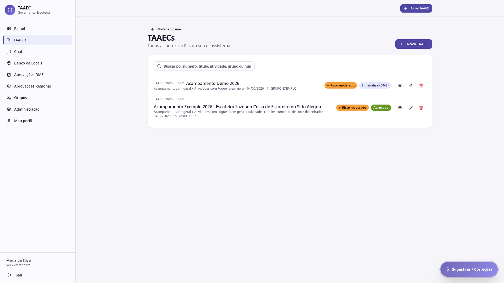
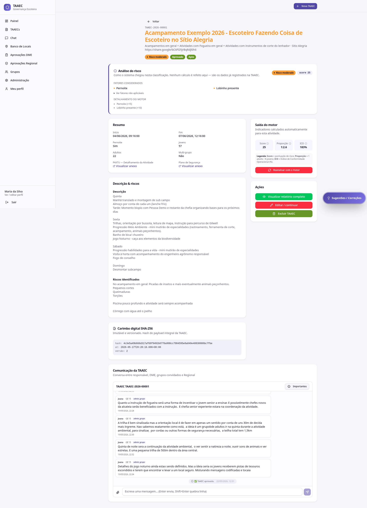
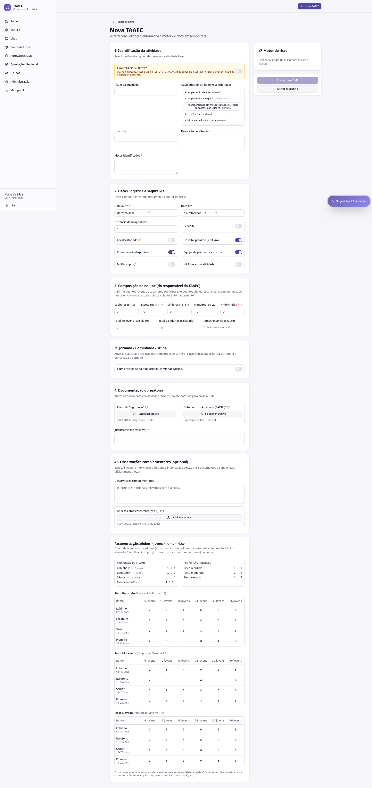

# TAAECs

A tela **TAAECs** é a lista de todas as autorizações do seu ecossistema. Daqui você pode buscar, abrir o detalhe, editar, excluir e criar uma nova.

---

## Cabeçalho

- **Voltar ao painel** — atalho para o Painel
- **TAAECs** (título) e descrição "Todas as autorizações do seu ecossistema"
- Botão **Nova TAAEC** — abre o wizard ([ver abaixo](#criar-uma-nova-taaec))

---

## Busca

Campo único de busca livre por:

- **Número** (ex: `TAAEC-2026-00001`)
- **Título** (ex: `Acampamento Exemplo 2026`)
- **Atividade** (ex: `Fogueira`)
- **Grupo** (ex: `GRUPO BETA`)
- **Numeral** (ex: `15`)

A lista filtra em tempo real conforme você digita.

---

## Itens da lista

Cada linha mostra:

| Coluna | Conteúdo |
|---|---|
| **Código** | Identificador único da TAAEC |
| **Título** | Nome dado pelo Responsável |
| **Atividades** | Soma das atividades selecionadas do catálogo |
| **Data** | Data de início da atividade |
| **Grupo** | Numeral + nome do grupo anfitrião |
| **Tag de risco** | Reduzido / Moderado / Elevado |
| **Status** | Em análise DME / Em análise Regional / Aprovado / Reprovado |
| **Ações** | Ver detalhes • Editar • Excluir |

!!! info "Quem pode excluir"
    O ícone de exclusão aparece apenas para usuários com permissão (Admin Mestre, Responsável da TAAEC enquanto em construção). A ação fica registrada no audit log.

---

## Detalhe de uma TAAEC

Clicar em **Ver detalhes** abre a página completa da TAAEC com cinco blocos:

### 1. Cabeçalho com status

Código, título, atividades selecionadas e local, mais três tags de status: **classificação de risco**, **status do fluxo** (Aprovado / Em análise / etc.) e **decisão do motor** (Apto / Com ressalva / Bloqueado).

### 2. Análise do risco

Mostra **como o sistema chegou na classificação**. Sem refazer cálculos — são os dados já registrados na TAAEC:

- **Tag de risco** + score numérico
- **Fatores considerados** (ex: *Pernoite*, *Lobinho presente*)
- **Detalhamento do motor** — quanto cada fator somou ao score (ex: `Pernoite (+15)`, `Lobinho presente (+10)`)
- Botão expansível **Ver fatores não aplicáveis**

### 3. Resumo

Dados-chave da atividade em duas colunas:

- Início, Fim, Pernoite (sim/não)
- Total de Jovens, Total de Adultos, Multi-grupo (sim/não)
- Anexos: **PAXTU — Detalhamento da Atividade** e **Plano de Segurança** com botão **Visualizar anexo**

### 4. Descrição & riscos

Texto livre do Responsável com:

- **Descrição** detalhada (programação, atividades por dia)
- **Riscos identificados** (picadas, cortes, queimaduras, atividade aquática, etc.)

### 5. Carimbo digital SHA-256

- **Hash** completo do payload da TAAEC
- **Timestamp** (data/hora de geração do carimbo)
- **Versão** (incrementa a cada edição relevante)

!!! info "Por que isso importa"
    O carimbo SHA-256 é a prova criptográfica de que a TAAEC não foi alterada depois de gerada. Qualquer mudança em qualquer campo gera novo hash e nova versão — o histórico fica preservado.

### 6. Saída do motor

Painel lateral com os três indicadores numéricos:

- **Score** — pontuação de risco
- **Proporção** — `1 adulto : N jovens`
- **ICO** — Índice de Conformidade Operacional (%)

E o botão **Reanalisar com o motor** — útil se a parametrização do motor mudou desde que a TAAEC foi criada e você quer revalidar.

### 7. Ações

- **Visualizar relatório completo** — gera o relatório institucional da TAAEC
- **Editar / continuar** — abre o wizard com os dados carregados (sujeito a permissão e status)
- **Excluir TAAEC** — irreversível, registrado no audit log

### 8. Comunicação da TAAEC

Bloco completo de chat com **histórico cronológico** das interações:

- Marcos automáticos: *TAAEC criada* · *enviada para análise do DME* · *enviada para a Regional* · *aprovada*
- Mensagens das pessoas (DME, Responsável, grupos convidados, Regional) com nome, grupo, papel e timestamp
- Campo para digitar nova mensagem, anexar arquivo e botão **Importantes** (filtra apenas mensagens marcadas como importantes)

Atalho global em [Chat](chat.md), onde você vê todas as suas conversas reunidas.

---

## Criar uma nova TAAEC

Clicar em **Nova TAAEC** abre o **wizard com validação automática e motor de risco em tempo real**:

O wizard é uma página única dividida em seções, com o **painel lateral do motor** acompanhando ao vivo cada alteração.

### Modo TESTE

Antes de qualquer campo, o toggle **É um TAAEC de TESTE?** permite preencher tudo sem consumir o contador oficial. TAAECs de teste recebem código `TESTE-AAAA-XXXXXX` e podem ser excluídas a qualquer momento. Use sempre que estiver experimentando o sistema.

### Seção 1 — Identificação da atividade

- **Título da atividade** (texto livre, obrigatório)
- **Atividades do catálogo** — lista de chips com a classificação de risco padrão de cada atividade ao lado (ex: *Acampamentos em geral · moderado*, *Atividade Aquática em geral · elevado*). Pode selecionar mais de uma; o motor considera a mais restritiva
- **Local** (texto livre, obrigatório) — pode digitar ou referenciar um local do [Banco de Locais](banco-locais.md)
- **Descrição detalhada** (texto livre, obrigatório)
- **Riscos identificados** (texto livre, obrigatório)

### Seção 2 — Datas, logística e segurança

| Campo | Tipo | Alimenta o motor |
|---|---|---|
| Data início* | Data | Sim |
| Data fim | Data | Sim |
| Distância do hospital (km) | Número | Sim |
| Pernoite | Switch | Sim (+15) |
| Local vistoriado | Switch | Sim |
| Hospital próximo (≤ 30 km) | Switch | Sim |
| Comunicação disponível | Switch | Sim |
| Equipe de primeiros socorros | Switch | Sim |
| Multi-grupo | Switch | Aciona seção de Grupos convidados |
| Há filhotes na atividade | Switch | Aciona checkbox de responsáveis legais |

Cada switch tem um botão **❓ Ajuda sobre o campo** ao lado com explicação contextual.

### Seção 3 — Composição da equipe

Quatro campos numéricos por ramo, mais o número de chefes:

- **Lobinhos** (6–10) · **Escoteiros** (11–14) · **Sêniores** (15–17) · **Pioneiros** (18–22) · **Nº de chefes**

Três campos calculados automaticamente:

- **Total de jovens** (soma dos 4 ramos)
- **Total de adultos**
- **Ramos envolvidos** (auto, baseado em quem tem >0 jovens)

### Seção "Jornada / Caminhada / Trilha"

Toggle dedicado. Quando ativo, a classificação considera distância, demarcação e pernoite específicos da jornada.

### Seção 4 — Documentação obrigatória

| Documento | Formato | Obrigatório |
|---|---|---|
| **Plano de Segurança** | PDF / DOCX / imagem (até 10 MB) | ✅ |
| **Detalhado da Atividade (PAXTU)** | PDF exportado do PAXTU | ✅ |
| **Justificativa (se ressalva)** | Texto livre | Quando aplicável |

### Seção 4.5 — Observações complementares

Texto livre + até **3 anexos** de apoio (atas, ofícios, mapas).

### Tabelas de parametrização

Abaixo do wizard, o sistema mostra as **tabelas de proporção** que o motor usa por risco (reduzido, moderado, elevado), cruzadas por ramo. Útil como referência para entender quantos adultos a sua atividade vai exigir antes mesmo de preencher.

!!! info "Como funciona a proporção"
    O motor aplica **sempre a proporção mais restritiva** entre o eixo do ramo e o eixo do risco. Exemplo: Lobinho em risco moderado com 12 jovens exige 3 adultos pela tabela de ramo (1:5) e 2 adultos pela tabela de risco (1:6) — o sistema exige **3 adultos** (a mais restritiva). O mínimo absoluto, em qualquer cenário, é **2 adultos**.

### Painel lateral — Motor de risco

À direita, atualizando ao vivo conforme você preenche:

- Tag de risco atual
- Score, Proporção, ICO
- Recomendações automáticas
- Avisos de regra crítica de override (quando aplicáveis)

Quando ainda não há dados suficientes, mostra: *"Preencha a data de início para iniciar o cálculo."*

### Botões de submissão

- **Salvar rascunho** — guarda como **em construção** (não envia para análise)
- **Enviar para DME** — só fica habilitado quando todos os campos obrigatórios e a proporção exigida estão atendidos. Submete a TAAEC à DME do grupo anfitrião e dispara notificação

!!! warning "Multigrupo bloqueia o envio"
    Em TAAECs multigrupo, **Enviar para DME** só fica habilitado depois que todos os grupos convidados concluírem suas [anuências](anuencias.md). Antes disso, o botão permanece desabilitado mesmo que os outros campos estejam OK.

---

## Por onde seguir

- **[Motor de risco](motor-de-risco.md)** — entenda como o score, ICO e proporção são calculados
- **[Aprovações DME](aprovacoes.md#aprovacoes-dme)** — o que acontece depois que você submete
- **[Anuências](anuencias.md)** — fluxo dos grupos convidados em TAAECs multigrupo
- **[Chat](chat.md)** — acompanhe a conversa de cada TAAEC em um só lugar
