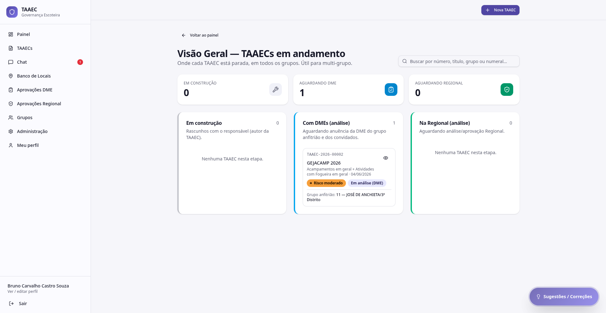

# Visão Geral

A tela **Visão Geral — TAAECs em andamento** mostra **onde cada TAAEC está parada**, em todos os grupos. É a visão estratégica usada por Regional e Admin Mestre para enxergar gargalos do ecossistema inteiro.

---

## Quem deve usar

- **Regional** — acompanhamento operacional do que está em curso na regional
- **Admin Mestre** — visão executiva agregada
- **DMEs** — não acessam (usam [Aprovações DME](aprovacoes.md#aprovacoes-dme) com escopo do próprio grupo)

---

## Cabeçalho

- **Voltar ao painel**
- Título e descrição: "Onde cada TAAEC está parada, em todos os grupos. Útil para multi-grupo."
- Campo de busca por número, título, grupo ou numeral

---

## Cards de etapas

Três cards superiores com contagem global em cada etapa do fluxo:

| Card | Significado |
|---|---|
| **Em construção** | Rascunhos com o Responsável (autor da TAAEC) |
| **Aguardando DME** | Submetidas, aguardando anuência da DME do grupo anfitrião e convidados |
| **Aguardando Regional** | Aprovadas pelo DME, aguardando parecer final |

---

## Colunas detalhadas

Abaixo dos cards, **três colunas** com os mesmos rótulos mostrando a **lista de TAAECs** em cada etapa:

### Em construção

Rascunhos com o Responsável. Quando vazia: *"Nenhuma TAAEC nesta etapa."*

### Com DMEs (análise)

TAAECs aguardando anuência. Para cada item, mostra:

- Código + título
- Atividades selecionadas + data
- Tag de risco + status atual
- **Grupo anfitrião** (numeral + nome)
- Link **Ver detalhes**

### Na Regional (análise)

TAAECs aguardando análise / aprovação Regional. Mesma estrutura.

---

## Para que serve

- **Detectar gargalo** — uma TAAEC parada há semanas em "Em construção" pode indicar que o Responsável precisa de apoio
- **Antecipar pico** — se há 5 TAAECs aguardando Regional com data próxima, a equipe regional sabe que precisa concentrar trabalho
- **Visão multigrupo** — quando uma TAAEC envolve dois ou três grupos, esta tela mostra o quadro completo do trâmite

!!! info "Diferença vs. Aprovações Regional"
    A **Visão Geral** é mais panorâmica — mostra todas as etapas do fluxo, não só a Regional. As **Aprovações Regional** focam apenas no que precisa de parecer da Regional e oferecem filtros e ações específicas (aprovar / devolver / reprovar). Use uma para entender o quadro; use a outra para agir.

---

## Por onde seguir

- **[Aprovações Regional](aprovacoes.md#aprovacoes-regional)** — para agir nas TAAECs que estão na sua fila
- **[Anuências](anuencias.md)** — para o ponto de vista do grupo convidado em TAAECs multigrupo
